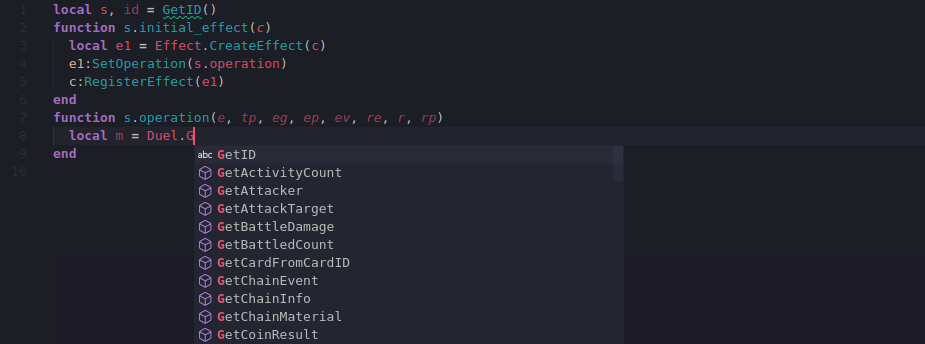
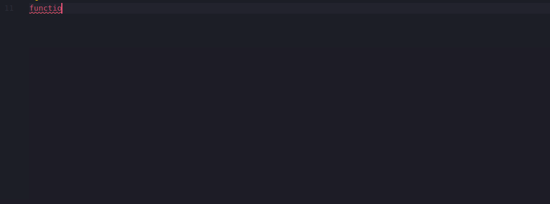

# YGOPro API Autocomplete extension for VSCode

This is an autocomplete extension for VSCode that covers the YGOPro scripting API, compatible with the bleeding-edge fork of the YGOPro client, [EDOPro](https://github.com/edo9300/edopro/).

## Features

- [x] Autocompletes constants, class names and methods.
- [x] Autocompletes card callbacks (condition, cost, target, operation, etc).
- [x] Provides description for each constant, method, callback, etc.
- [x] Adapts method calls for `.` and `:`.
- [x] Infers type from method return types, callback signatures and identifier name.
- [x] Automatic database updates.

You can search for callbacks by their usage. When defining a function, type `$` as the first character, then write an `EFFECT_` constant (or similar) to find callbacks used by those effect types/codes.

## Extension Settings

This extension contributes the following settings:

- `autocomplete-ygoproapi.matchCaseForConstants`
- `autocomplete-ygoproapi.suggestOptionalArguments`
- `autocomplete-ygoproapi.useSpacing`
- `autocomplete-ygoproapi.updateFrequency`